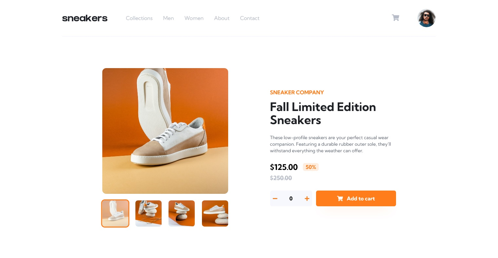

# Frontend Mentor - E-commerce product page solution

This is a solution to the [E-commerce product page challenge on Frontend Mentor](https://www.frontendmentor.io/challenges/ecommerce-product-page-UPsZ9MJp6). Frontend Mentor challenges help you improve your coding skills by building realistic projects.

## Table of contents

- [Overview](#overview)
  - [The challenge](#the-challenge)
  - [Screenshot](#screenshot)
  - [Links](#links)
- [My process](#my-process)
  - [Built with](#built-with)
  - [What I learned](#what-i-learned)
  - [Continued development](#continued-development)
- [Author](#author)

## Overview

### The challenge

Users should be able to:

- View the optimal layout for the site depending on their device's screen size
- See hover states for all interactive elements on the page
- Open a lightbox gallery by clicking on the large product image
- Switch the large product image by clicking on the small thumbnail images
- Add items to the cart
- View the cart and remove items from it

### Screenshot

### Links

- Solution URL: https://www.frontendmentor.io/solutions/ecommerce-product-page-8YUn2c693
- Live Site URL: https://radekl99.github.io/ecommerce-product-page/

## My process

### Built with

- Semantic HTML5 markup
- Flexbox
- Mobile-first workflow
- [React](https://reactjs.org/) - JS library
- [Redux](https://redux.js.org/) - For simple Cart store
- [Tailwind CSS](https://tailwindcss.com/) - For styles
- [Font Awesome](https://fontawesome.com/) - For icons

### What I learned

In this project I was practicing development of responsive design. For the first time I implemented lightbox gallery and this was first project in which I used Tailwind CSS.

### Continued development

In future projects I will be focused on creating more flexible and universal React components. I think I also need to creating more components in my projets to split code more and by that making important componets more linear.

## Author

Radosław Łaszek

- Frontend Mentor - [@radekl99](https://www.frontendmentor.io/profile/radekl99)
